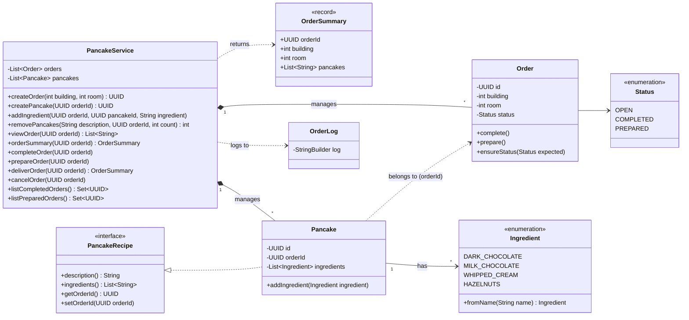
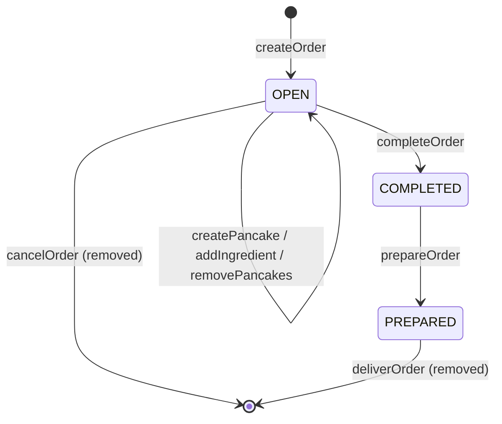

# Pancake Lab – Solution

This document describes how the original Pancake Lab code was refactored to meet the
Sensei's conditions. The original assignment is in [README.md](README.md).

## Solution overview

| Requirement | How it is addressed                                                                                                                                                                                                                                                                                                                                          |
|---|--------------------------------------------------------------------------------------------------------------------------------------------------------------------------------------------------------------------------------------------------------------------------------------------------------------------------------------------------------------|
| Object-oriented | Behaviour lives with the data: `Order` enforces its own lifecycle and validation, `Pancake` owns its ingredients.                                                                                                                                                                                                                                            |
| TDD | New behaviour was added test-first. Total : 27 tests.                                                                                                                                                                                                                                                                                                        |
| Pure Java, no frameworks | Only the JDK is used in production code. JUnit 5 is used for tests only.                                                                                                                                                                                                                                                                                     |
| API does not expose domain objects | `PancakeService` accepts and returns only `UUID`, `String`, `int`, read-only collections and the immutable `OrderSummary` record. `Order` and `Pancake` never leave the service.                                                                                                                                                                             |
| No hardcoded recipes | The five pancake subclasses and their `addXxxPancake` methods were removed. A pancake is whatever ingredients the disciple adds.                                                                                                                                                                                                                             |
| Add ingredient after ingredient, no builders | `createPancake(orderId)` returns a pancake ID; `addIngredient(orderId, pancakeId, ingredient)` adds one ingredient at a time.                                                                                                                                                                                                                                |
| Input validation | Unknown orders, pancakes and ingredients are rejected; building and room must be ≥ 1; operations are only allowed in the right order status.                                                                                                                                                                                                                 |
| Data races | Every public method of `PancakeService` is `synchronized`, so each operation, including its checks, is atomic. A more object-oriented approach would let each `Order` own its pancakes and guard its own state with its own lock, while the service keeps orders in a `ConcurrentHashMap` and delegates, so different orders could be processed in parallel. 
| UML documentation | Class diagram and order lifecycle diagram below.                                                                                                                                                                                                                                                                                                             |

## Class diagram



## Order lifecycle



Any other transition is rejected with `IllegalStateException`.

## Design decisions

- **Composition over inheritance.** The inheritance chain (`DarkChocolatePancake` →
  `DarkChocolateWhippedCreamPancake` → …) needed a new class for every combination.
  It was replaced by a single `Pancake` that holds a list of `Ingredient`s, moving from is-a to has-a relationship.
- **The `Ingredient` enum is the menu.** Only listed ingredients can be added, which
  blocks Dr. Fu Man Chu's mustard. Adding a new ingredient is a one-line change.
- **The lifecycle lives inside `Order`.** `complete()` and `prepare()` only allow valid
  transitions, and the service checks `ensureStatus(...)` before changing an order.
  There is no way to set an arbitrary status.
- **Validation in the constructor.** An `Order` with an invalid building or room can
  never be created, no matter who creates it.
- **Two kinds of errors.** `IllegalArgumentException` for invalid input (unknown ID,
  unknown ingredient, invalid building). `IllegalStateException` for a valid request made
  at the wrong time (e.g. adding a pancake to a completed order).
- **Checks before changes.** Every operation validates first and only then modifies
  state, so a rejected request leaves the order unchanged.
- **Minimal changes.** The existing classes and method names were kept where possible;
  only one small new type (`OrderSummary`) was added to the API.
- **Bugs fixed along the way.** Mustard removed from the recipe, cancellation no longer
  logged twice, and the removed-pancake count is now correct (and returned to the caller).

## Assumptions

- The assignment does not define which buildings and rooms exist, so only values that can
  never be valid (< 1) are rejected.
- An order can only be cancelled while it is `OPEN`.
- Ingredient names must match the menu exactly (e.g. `"dark chocolate"`, case-sensitive).
- Empty pancakes, empty orders and repeated ingredients are allowed.
- `viewOrder` returns an empty list for an unknown or already removed order.

## Concurrency

- Every public method of `PancakeService` is `synchronized`. This prevents lost updates,
  reads during modification, and check-then-act races (for example, a disciple adding an
  ingredient while the Chef completes the same order).
- This is safe because no domain object leaves the service. `Order` and `Pancake` are
  only ever accessed while the service lock is held; callers only receive IDs, copies and
  immutable records.
- `OrderLog` writes to a shared static log, so its methods are `static synchronized`.
    The log is safe regardless of how many `PancakeService` instances exist.
- **Trade-off:** all orders are serialised through one lock. This is simple and correct
  for the Dojo's scale. For higher throughput, pancakes would move into `Order`, each order
  would be locked individually, and orders would be stored in a `ConcurrentHashMap`.
- A concurrency test adds 1000 pancakes from 16 threads at once and checks that none are lost.

## How to run

```bash
mvn test
```

## Possible next steps

- Lock per order instead of one lock for the whole service.
- Remove `orderId` / `setOrderId` from `Pancake` by letting `Order` own its pancakes.
- Validate buildings and rooms against a real list provided by the Dojo.
- Ingredient combination rules (e.g. "no mustard with chocolate"), which could be
  extracted into a pluggable validation policy if they grow.